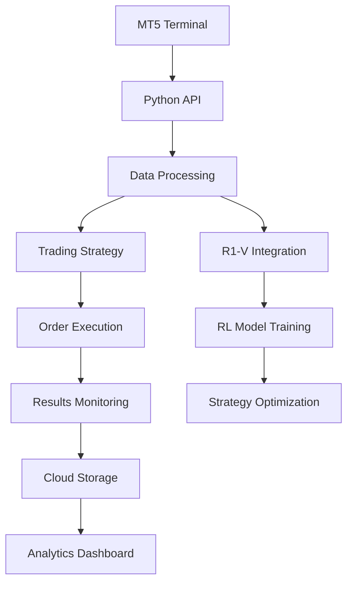

# MetaTrader 5 Python Trading System

## Table of Contents
1. [Project Overview](#project-overview)
2. [System Architecture](#system-architecture)
3. [Setup Instructions](#setup-instructions)
   - [Local Environment](#local-environment)
   - [Azure Cloud Setup](#azure-cloud-setup)
4. [Configuration Guide](#configuration-guide)
   - [MT5 Configuration](#mt5-configuration)
   - [Azure Configuration](#azure-configuration)
5. [Script Documentation](#script-documentation)
6. [Trading Strategy](#trading-strategy)
7. [R1-V Integration](#r1-v-integration)
8. [Usage Examples](#usage-examples)
9. [Troubleshooting](#troubleshooting)
10. [Maintenance & Monitoring](#maintenance--monitoring)

## Project Overview
This project provides a comprehensive trading system that integrates MetaTrader 5 with Python for automated trading. The system includes:

- Real-time market data processing
- Automated trade execution
- Reinforcement learning integration with R1-V
- Cloud deployment capabilities
- Comprehensive monitoring and logging

## System Architecture


## Setup Instructions

### Local Environment
1. Install Python 3.11.8 (exact version):
   ```bash
   pyenv install 3.11.8
   pyenv global 3.11.8
   ```

2. Install system dependencies:
   ```bash
   sudo apt-get update
   sudo apt-get install -y build-essential libssl-dev zlib1g-dev \
   libbz2-dev libreadline-dev libsqlite3-dev wget curl llvm \
   libncurses5-dev libncursesw5-dev xz-utils tk-dev libffi-dev \
   liblzma-dev python-openssl git
   ```

3. Install Python packages with exact versions:
   ```bash
   pip install -r requirements.txt --upgrade
   pip install \
   backtrader==1.9.76.123 \
   MetaTrader5==5.0.43 \
   numpy==1.26.4 \
   pandas==2.1.4 \
   scikit-learn==1.3.2 \
   torch==2.1.1 \
   transformers==4.35.2
   ```

4. Configure MT5:
   - Install MetaTrader 5 (build 2560 or later)
   - Create demo account with at least $10,000 balance
   - Enable Python API in terminal settings:
     1. Tools > Options > Expert Advisors
     2. Enable "Allow automated trading"
     3. Enable "Allow DLL imports"
     4. Set "Maximum bars in chart" to 1000000

5. Prepare historical data:
   - Download EURUSD M1 data from 2010-present
   - Convert to CSV format with OHLCV columns
   - Store in data/historical_data.csv
   - Verify data integrity:
     ```python
     import pandas as pd
     df = pd.read_csv('data/historical_data.csv')
     assert df.shape[0] > 1000000, "Insufficient historical data"
     assert set(df.columns) == {'timestamp', 'open', 'high', 'low', 'close', 'volume'}, "Invalid column structure"
     ```

6. Initialize RL model:
   ```bash
   python -c "from RLTrader import RLTrader; trader = RLTrader(); trader.initialize_model()"
   ```

7. Verify installation:
   ```bash
   python -m pytest tests/
   ```

### Azure Cloud Setup
1. Create Azure account
2. Set up GPU-enabled VM:
   ```bash
   az vm create --resource-group TradingGroup --name RL-Trader-VM \
   --image UbuntuLTS --size Standard_NC6 --admin-username azureuser
   ```
3. Install dependencies:
   ```bash
   sudo apt update
   sudo apt install python3-pip
   pip install -r requirements.txt
   ```

## Configuration Guide

### MT5 Configuration
Edit `config/mt5_config.json`:
```json
{
  "login": "YOUR_ACCOUNT_NUMBER",
  "password": "YOUR_PASSWORD",
  "server": "YOUR_BROKER",
  "symbols": ["EURUSD","XAUUSD","GBPUSD"],
  "timeframe": "M5",
  "update_interval": 60
}
```

### Azure Configuration
1. Set up storage account:
   ```bash
   az storage account create --name tradingstorage --resource-group TradingGroup
   ```
2. Configure monitoring:
   ```bash
   az monitor log-analytics workspace create --resource-group TradingGroup --workspace-name TradingLogs
   ```

## Script Documentation

| Script | Purpose | Parameters |
|--------|---------|------------|
| main.py | Main execution | --mode [backtest/live], --risk [0.01-0.05] |
| mt5_live_data.py | Real-time data feed | --symbol [currency pair], --timeframe [M1-M30] |
| run_rl_trader.py | RL strategy execution | --model [path], --episodes [number] |
| test_runner.py | Strategy testing | --strategy [name], --period [days] |

## Trading Strategy

### Reinforcement Learning Strategy (RLBacktraderStrategy)
The RLBacktraderStrategy integrates reinforcement learning with Backtrader's trading engine. Key features include:

1. **RL Integration**
   - Uses RLTrader class for decision making
   - Supports periodic model training
   - Implements reward-based learning

2. **Core Components**
   - Episode-based training system
   - Trade history tracking
   - Reward calculation based on P&L
   - Automated position management

3. **Configuration Parameters**
   ```python
   params = (
       ('training_episodes', 10),  # Number of training episodes
       ('historical_data_path', 'data/historical_data.csv')  # Path to market data
   )
   ```

4. **Execution Flow**
   - Initialize RL model and environment
   - Process market data through RL agent
   - Execute trades based on RL actions
   - Calculate rewards and update model
   - Log performance metrics

5. **Risk Management**
   - Position sizing based on account balance
   - Stop-loss and take-profit levels
   - Daily loss limits
   - Trade frequency controls

## R1-V Integration

### Overview
The R1-V repository provides advanced reinforcement learning capabilities for the trading system. Key features include:

- GRPO (Generalized Reinforcement Policy Optimization) implementation
- Multi-GPU training support
- Advanced reward shaping
- Comprehensive logging and monitoring

### Setup
1. Clone the R1-V repository:
   ```bash
   git clone https://github.com/your-org/R1-V-repo.git
   ```

2. Install dependencies:
   ```bash
   cd R1-V-repo
   pip install -r requirements.txt
   ```

3. Configure training:
   ```bash
   python src/r1-v/local_scripts/train_qwen2_vl.sh
   ```

### Configuration
Edit `src/r1-v/configs/qwen2vl_sft_config.yaml`:
```yaml
training:
  batch_size: 32
  learning_rate: 0.0001
  num_epochs: 10
  checkpoint_dir: ./checkpoints
```

### Usage
```bash
# Start training
python src/r1-v/run_grpo.sh

# Run inference
python src/r1-v/src/open_r1/generate.py
```

## Usage Examples

### Backtesting
```bash
python main.py --mode backtest --strategy breakout --period 30
```

### Live Trading
```bash
python main.py --mode live --risk 0.02
```

### Cloud Training
```bash
python run_rl_trader.py --model grpo --episodes 1000
```

## Troubleshooting

| Issue | Solution |
|-------|----------|
| MT5 connection failed | 1. Verify terminal is running<br>2. Check firewall settings<br>3. Validate credentials |
| No historical data | 1. Confirm symbol is valid<br>2. Check broker permissions<br>3. Adjust timeframe |
| Azure VM connection issues | 1. Verify SSH keys<br>2. Check network security groups<br>3. Confirm subscription status |
| R1-V integration errors | 1. Verify repository structure<br>2. Check config files<br>3. Validate training data |

## Maintenance & Monitoring

### Scheduled Tasks
- Daily performance reports
- Weekly model retraining
- Monthly strategy optimization

### Monitoring Tools
- Azure Monitor
- MT5 Journal
- Custom logging system

### Alert System
```python
def send_alert(message):
    if config['alerts_enabled']:
        requests.post(config['webhook_url'], json={
            "text": f"[Trading Alert] {message}"
        })
```

## Future Enhancements
1. Multi-currency portfolio management
2. Advanced risk modeling
3. Machine learning integration
4. Mobile monitoring app

---

Happy Trading!
